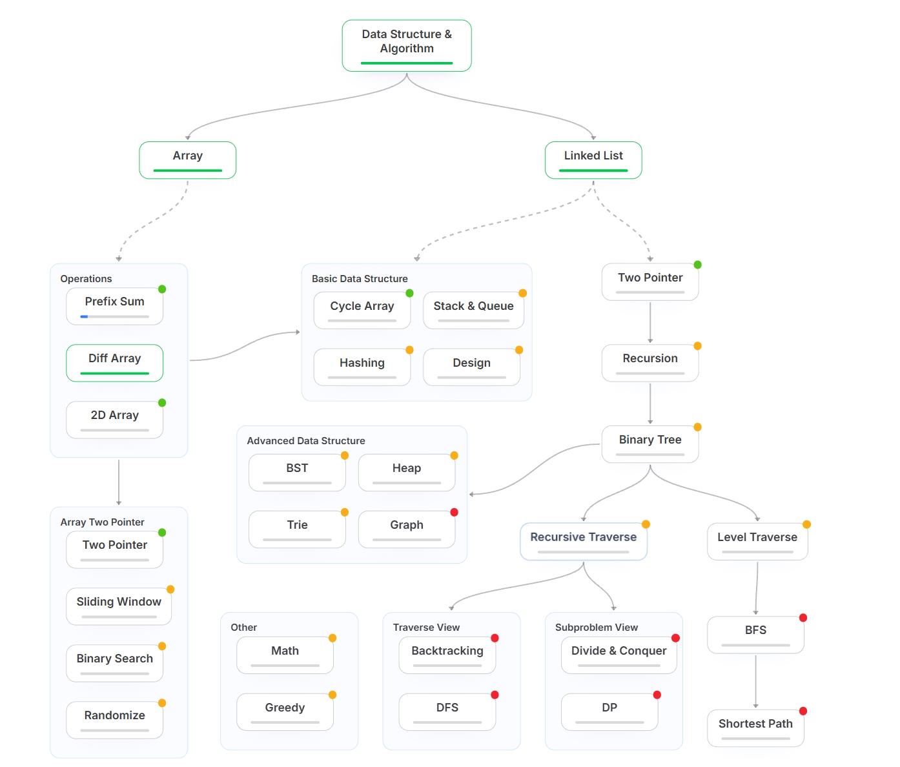

# LeetCode

Self-study notes and C++ solutions.  
Data structures first, then algorithms — start from brute-force, then cut time and space.

| Resource | Link |
| --- | --- |
| Course | [labuladong.online](https://labuladong.online/en/) |
| Problems | [leetcode.com](https://leetcode.com) |
| Core idea | [DataStructureAndAlgorithms/Summary.md](DataStructureAndAlgorithms/Summary.md) |

## Outline

The map follows two trunks: **Array** and **Linked List**.  
Green dots are in progress; later topics (tree, graph, DP) stay on the right branch.

## Notes

**Array**

- [Dynamic Array](DataStructureAndAlgorithms/DataStructure/Array/DynamicArray.md)
- [Prefix Sum](DataStructureAndAlgorithms/Algorithms/PrefixSum.md)
- [Difference Array](DataStructureAndAlgorithms/Algorithms/DifferenceArray.md)

**Linked List**

- [Linked List](DataStructureAndAlgorithms/DataStructure/LinkedList/LinkedList.md)

**How to think**

- [Brute Force](DataStructureAndAlgorithms/Algorithms/BruteForce.md)
- [Recursion](DataStructureAndAlgorithms/Algorithms/Recursion.md)

## Problems

| Algorithm Idea   | Related Problems |
| ---------------- | ------------------------------------------------- |
| Hash Table       | [1. Two Sum](Problems/1.Two%20Sum.cpp) |
| Prefix Sum       | [303. Range Sum Query](Problems/303.Range%20Sum%20Query.cpp) [304. Range Sum Query 2D](Problems/304.Range%20Sum%20Query%202D.cpp) |
| Difference Array | [1094. Car Pooling](Problems/1094.Car%20Pooling.cpp) [1109. Corporate Flight Bookings](Problems/1109.Corporate%20Flight%20Bookings.cpp) |
| Recursion / DP   | [509. Fibonacci Number](Problems/509.Fibonacci%20Number.cpp) |
| Backtracking     | [46. Permutations](Problems/46.Permutations.cpp) |
| Linked List      | [707. Design Linked List](Problems/707.Design%20Linked%20List.cpp) |
| Dynamic Array    | [Design Dynamic Array](Problems/Design%20Dynamic%20Array.cpp) |
